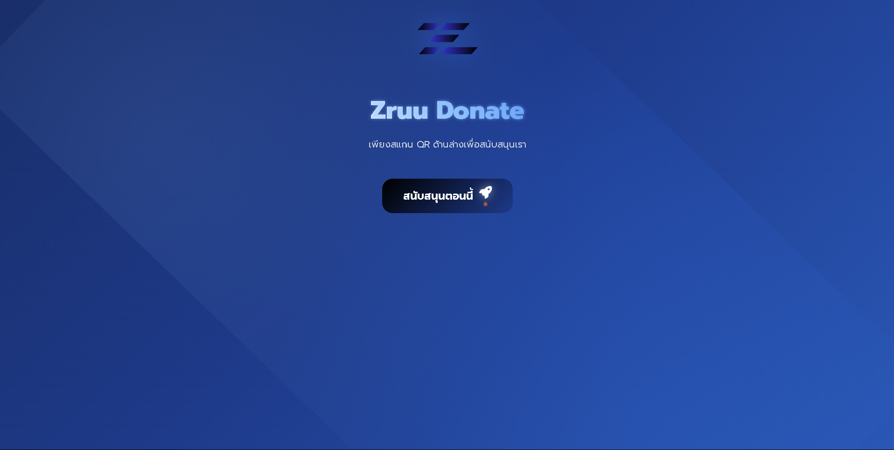
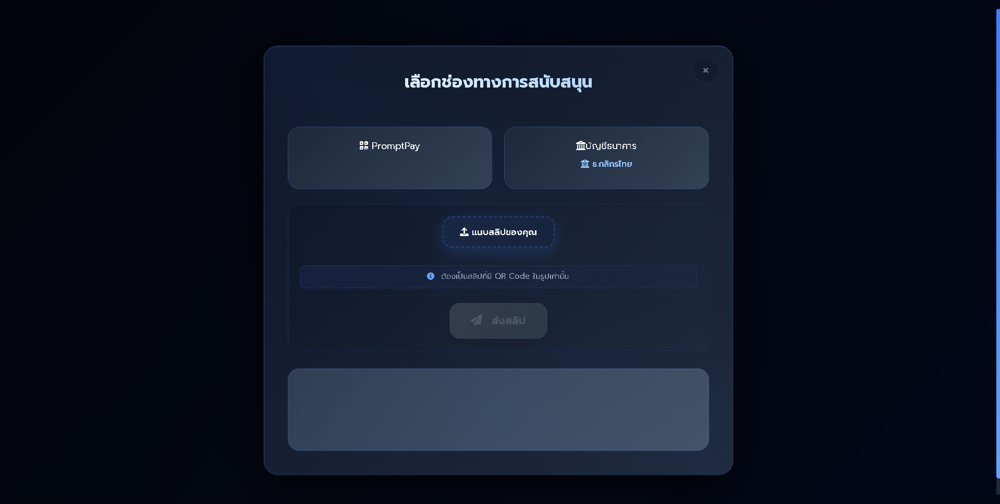
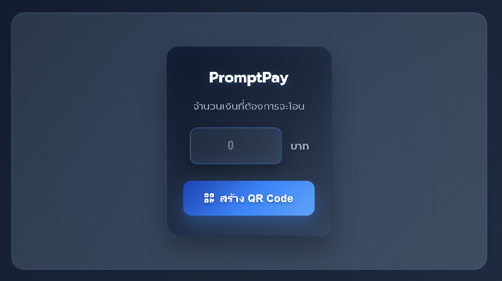

# 💸 ZruuDonate | Personal Donation Web – โดเนทส่วนตัวสุดเท่

เว็บไซต์โดเนทส่วนบุคคล ที่ใครก็สามารถใช้งานได้  
รองรับการโดเนทผ่าน **PromptPay** และ **ธนาคาร**  
พร้อมระบบสร้าง QR Code อัตโนมัติเมื่อกรอกจำนวนเงิน

> 🖌️ UI สุดสวย ปรับแต่งได้ภายในเว็บ ใช้ง่ายทั้งมือถือและเดสก์ท็อป

---

## 🚀 ฟีเจอร์เด่น

- ✅ รองรับ PromptPay QR Code อัตโนมัติ
- ✅ รองรับการโอนผ่านบัญชีธนาคาร
- ✅ ปรับแต่งหน้าตาเว็บแบบเรียลไทม์
- ✅ รองรับ Responsive Design สำหรับมือถือ
- ✅ เหมาะสำหรับใช้งานส่วนตัว หรือแจกเพื่อน ๆ

---

## 💳 การทำงานของระบบ PromptPay

เมื่อผู้ใช้งานกรอกจำนวนเงิน ระบบจะเรียก API สำหรับสร้าง QR Code พร้อมข้อมูล:

- หมายเลข PromptPay (เบอร์โทรศัพท์ / บัตรประชาชน)  
- จำนวนเงินที่กำหนด

---

## 🙏 ขอบคุณ API

เว็บไซต์นี้ใช้ API สำหรับสร้าง PromptPay QR Code จากผลงานของคุณ  
**Tavon Seesenpila**  
🔗 [PP-QR](https://www.pp-qr.com/)

---

## 🖼️ ตัวอย่างหน้าจอ





## 🛠 วิธีใช้งาน

### 1. Clone โปรเจกต์

```bash
git clone https://github.com/Nexzerf/ZruuDonate.git
cd ZruuDonate

